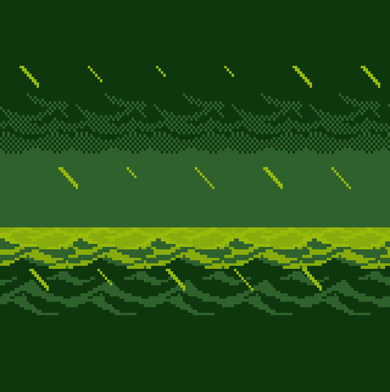
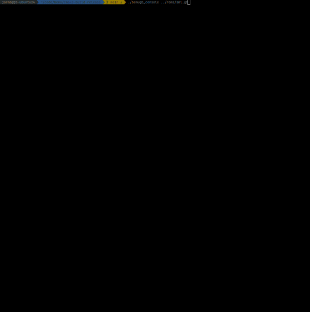

# BEMU

(Yet another) Game Boy emulator, written in C++. Made for fun with love for some of the greatest games ever made.

Renders straight to terminal using ncurses.



Rewind time by holding down backspace!



## Development environment setup

### Linux

```bash
sudo apt update
sudo apt install libncurses5-dev libncursesw5-dev
```

## Resources

Thanks to:
- https://gbdev.io
- https://rgbds.gbdev.io
- https://emulicious.net/downloads/
- https://github.com/retrio/gb-test-roms
- https://damieng.com/typography/zx-origins/
